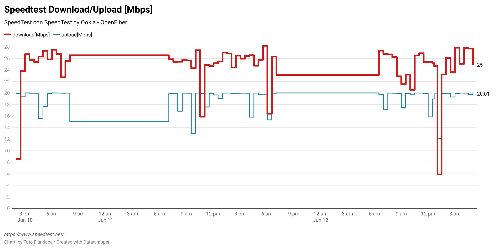

# speedtest-parabola
SpeedTest con SpeedTest Ookla https://www.speedtest.net/

## GDrive sheet

espressione per importare il file csv

```
=IMPORTDATA("https://raw.githubusercontent.com/pigreco/speedtest-parabola/main/output/toto-migliorato.csv")
```

## Unità di pianificazione sotto Win 10

1. Avvia script.sh per lo speedtest;
2. Avvia script-push.sh per il commit nel repository

## Grafico



<https://www.datawrapper.de/_/osd2p/>

# Intestazioni per l'output di speedtest -f csv

L'output del comando `speedtest -f csv` non include le intestazioni dei campi nella sua risposta. Basandomi sul formato dell'output che hai condiviso, ecco le intestazioni corrispondenti ai valori:

1. `server_name` - "Wind Tre - Roma"
2. `server_id` - "29317"
3. `latency` - "29.7461" (in ms)
4. `jitter` - "0.4205" (in ms)
5. `packet_loss` - "0" (percentuale)
6. `download` - "7691990" (bit/s)
7. `upload` - "35136975" (bit/s)
8. `download_bytes` - "86176664" 
9. `upload_bytes` - "326499653"
10. `share_url` - "https://www.speedtest.net/result/c/16ae5522-b323-4929-ba22-8ad2ef211cdd"
11. `download_server_count` - "1"
12. `download_latency` - "28.3233" (in ms)
13. `download_latency_jitter` - "0.583881" (in ms)
14. `download_latency_low` - "27.055" (in ms)
15. `download_latency_high` - "30.07" (in ms)
16. `upload_latency` - "47.2861" (in ms)
17. `upload_latency_jitter` - "1.6291" (in ms)
18. `upload_latency_low` - "29.391" (in ms)
19. `upload_latency_high` - "57.564" (in ms)
20. `idle_latency` - "28.896" (in ms)
21. `idle_latency_high` - "30.23" (in ms)
